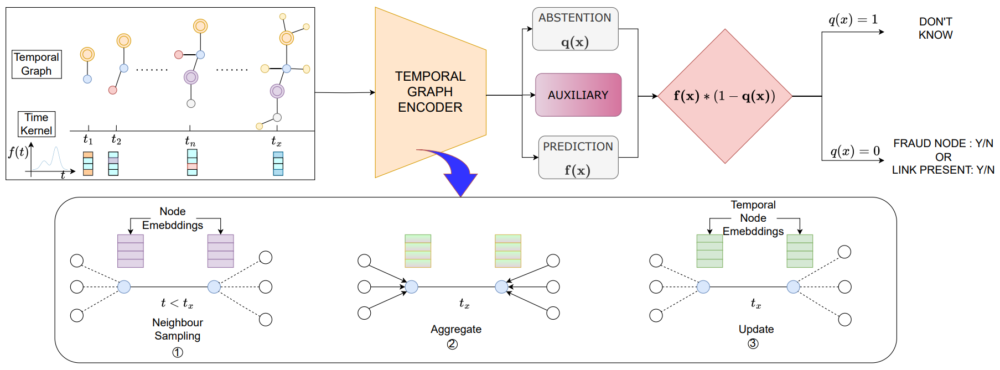
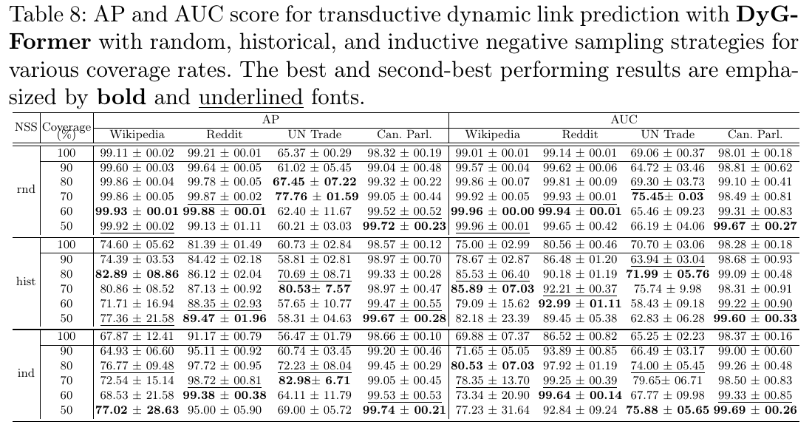
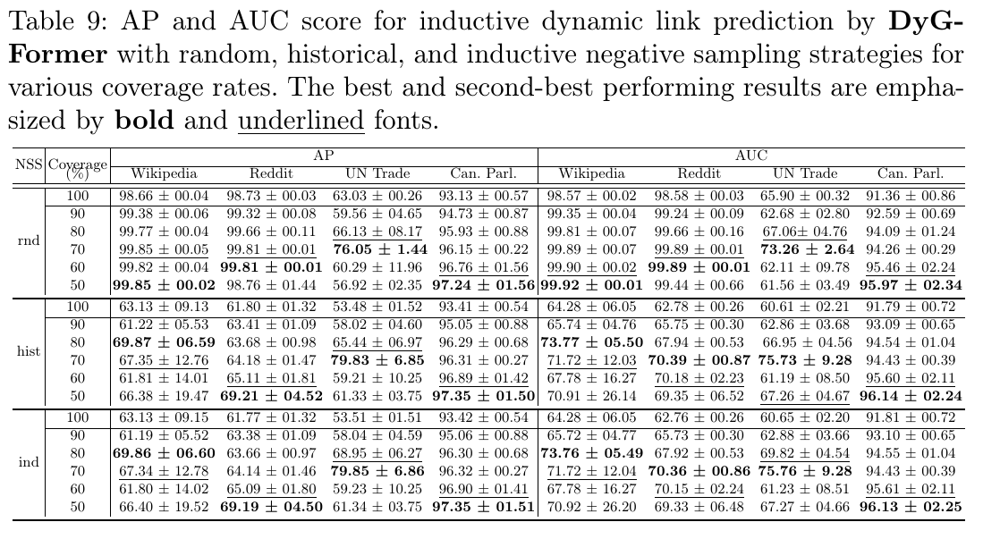
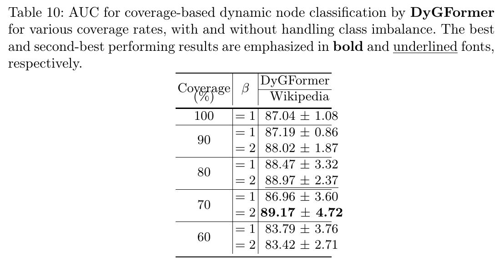

# Confidence First: Reliability-Driven Temporal Graph Neural Networks
This repository is built for the paper "Confidence First: Reliability-Driven Temporal Graph Neural Networks".


## Overview
This repository is built on Dynamic Graph Library ([DyGLib](https://github.com/yule-BUAA/DyGLib)), which is an open-source toolkit with standard training pipelines, extensible coding interfaces, and comprehensive evaluating strategies,
which aims to promote standard, scalable, and reproducible dynamic graph learning research. Diverse benchmark datasets and thorough baselines are involved in DyGLib.
<!--  -->

## Additional Results
- Main results are summarized in `Table 1, 2` and `Fig 3` in the paper.
- <span style="color: red;">For extended findings, see the [additional results PDF](additional_results/appendix.pdf).</span>

## Benchmark Datasets and Preprocessing

Fourteen datasets are used in DyGLib, including Wikipedia, Reddit, MOOC, LastFM, Myket, Enron, Social Evo., UCI, Flights, Can. Parl., 
US Legis., UN Trade, UN Vote, and Contact. The first five datasets are bipartite, and the others only contain nodes with a single type. We have used only four datasets Wikipedia, Reddit, Can. Parl., UN Trade in our experiments but can be extended with any other dataset.

Most of the used original dynamic graph datasets come from [Towards Better Evaluation for Dynamic Link Prediction](https://openreview.net/forum?id=1GVpwr2Tfdg), 
which can be downloaded [here](https://zenodo.org/record/7213796#.Y1cO6y8r30o). 
Please download them and put them in ```dataset``` folder.


We can run ```preprocess_data/preprocess_data.py``` for pre-processing the datasets.
For example, to preprocess the *Wikipedia* dataset, we can run the following commands:
```{bash}
cd preprocess_data/
python preprocess_data.py  --dataset_name wikipedia
```
We can also run the following commands to preprocess all the original datasets at once:
```{bash}
cd preprocess_data/
python preprocess_all_data.py
```

## Dynamic Graph Learning Models

Nine popular continuous-time dynamic graph learning methods are included in DyGLib, including
[JODIE](https://dl.acm.org/doi/10.1145/3292500.3330895), 
[DyRep](https://openreview.net/forum?id=HyePrhR5KX), 
[TGAT](https://openreview.net/forum?id=rJeW1yHYwH), 
[TGN](https://arxiv.org/abs/2006.10637), 
[CAWN](https://openreview.net/forum?id=KYPz4YsCPj), 
[EdgeBank](https://openreview.net/forum?id=1GVpwr2Tfdg), 
[TCL](https://arxiv.org/abs/2105.07944),
[GraphMixer](https://openreview.net/forum?id=ayPPc0SyLv1), and
[DyGFormer](https://arxiv.org/abs/2303.13047).

We have used TGN, GraphMixer and DyGFormer as the baseline for our experiments but it can be extended with any other CTDG method given in DyGLib.
<!-- is also integrated into Cover_DyGLib, which can explore the correlations of the source node and destination node by a neighbor co-occurrence encoding scheme, and -->
<!-- effectively and efficiently benefit from longer histories via a patching technique. -->
<!--  -->


## Evaluation Tasks

It supports dynamic link prediction under both transductive and inductive settings with three (i.e., random, historical, and inductive) negative sampling strategies,
as well as dynamic node classification with the coverage based classification with rejection


<!-- ## Incorporate New Datasets or New Models -->

<!-- New datasets and new models are welcomed to be incorporated into DyGLib by pull requests. -->
<!-- * For new datasets: The format of new datasets should satisfy the requirements in ```DG_data/DATASETS_README.md```. -->
<!--   Users can put the new datasets in ```DG_data``` folder, and then run ```preprocess_data/preprocess_data.py``` to get the processed datasets. -->
<!-- * For new models: Users can put the model implementation in  ```models``` folder, -->
<!--   and then create the model in ```train_xxx.py``` or ```evaluate_xxx.py``` to run the model. -->


## Environments

[PyTorch 12.1](https://pytorch.org/),
[numpy](https://github.com/numpy/numpy),
[pandas](https://github.com/pandas-dev/pandas),
[tqdm](https://github.com/tqdm/tqdm), and 
[tabulate](https://github.com/astanin/python-tabulate)


## Executing Scripts

<!--### Scripts for Dynamic Link Prediction
Dynamic link prediction could be performed on all the thirteen datasets. 
If you want to load the best model configurations determined by the grid search, please set the *load_best_configs* argument to True.
#### Model Training
* Example of training *DyGFormer* on *Wikipedia* dataset:
```{bash}
python train_link_prediction.py --dataset_name wikipedia --model_name DyGFormer --patch_size 2 --max_input_sequence_length 64 --num_runs 5 --gpu 0
```
* If you want to use the best model configurations to train *TGN* on *Wikipedia* dataset, run
```{bash}
python train_link_prediction.py --dataset_name wikipedia --model_name TGN --load_best_configs --num_runs 5 --gpu 0
```
#### Model Evaluation
Three (i.e., random, historical, and inductive) negative sampling strategies can be used for model evaluation.
* Example of evaluating *DyGFormer* with *random* negative sampling strategy on *Wikipedia* dataset:
```{bash}
python evaluate_link_prediction.py --dataset_name wikipedia --model_name DyGFormer --patch_size 2 --max_input_sequence_length 64 --negative_sample_strategy random --num_runs 5 --gpu 0
```
* If you want to use the best model configurations to evaluate *TGN* with *random* negative sampling strategy on *Wikipedia* dataset, run
```{bash}
python evaluate_link_prediction.py --dataset_name wikipedia --model_name TGN --negative_sample_strategy random --load_best_configs --num_runs 5 --gpu 0
```-->
### Scripts for Coverage Based Dynamic Link Prediction
Dynamic link prediction could be performed on all the thirteen datasets and any model supported in
[DyGLib](https://github.com/yule-BUAA/DyGLib) like TGN, GraphMixer, TGAT, DyGFormer etc.
If you want to load the best model configurations determined by the grid search, please set the *load_best_configs* argument to True.
#### Model Training
* If you want to use the best model configurations to train *TGN* on *Wikipedia* dataset, run
```{bash}
python cvr_train_link_prediction.py --dataset_name wikipedia --model_name TGN --coverage 0.7 --load_best_configs --lambda_val 32 --num_runs 5 --gpu 0
```

#### Model Evaluation
* If you want to use the best model configurations to evaluate *TGN* with *random* negative sampling strategy on *Wikipedia* dataset, run
```{bash}
python cvr_evaluate_link_prediction.py --dataset_name wikipedia --model_name TGN --coverage 0.7 --load_best_configs --lambda_val 32 --negative_sample_strategy random --num_runs 5 --gpu 0
```

### Dynamic link prdecition results on DyGFormer
* AP and AUC score for transductive dynamic link prdecition with DyGFormer


* AP and AUC score for inductive dynamic link prdecition with DyGFormer


<!--### Scripts for Dynamic Node Classification
Dynamic node classification could be performed on Wikipedia and Reddit (the only two datasets with dynamic labels).
#### Model Training
* Example of training *DyGFormer* on *Wikipedia* dataset:
```{bash}
python train_node_classification.py --dataset_name wikipedia --model_name DyGFormer --patch_size 2 --max_input_sequence_length 64 --num_runs 5 --gpu 0
```
* If you want to use the best model configurations to train *TGN* on *Wikipedia* dataset, run
```{bash}
python train_node_classification.py --dataset_name wikipedia --model_name TGN --load_best_configs --num_runs 5 --gpu 0
```
#### Model Evaluation
* Example of evaluating *DyGFormer* on *Wikipedia* dataset:
```{bash}
python evaluate_node_classification.py --dataset_name wikipedia --model_name DyGFormer --patch_size 2 --max_input_sequence_length 64 --num_runs 5 --gpu 0
```
* If you want to use the best model configurations to evaluate *TGN* on *Wikipedia* dataset, run
```{bash}
python evaluate_node_classification.py --dataset_name wikipedia --model_name TGN --load_best_configs --num_runs 5 --gpu 0
```-->
### Scripts for Coverage Based Dynamic Node Classification
#### Model Training
* If you want to use the best model configurations to train *TGN* on *Wikipedia* dataset, run
```{bash}
python cvr_train_node_classification.py --dataset_name wikipedia --model_name TGN --load_best_configs --num_runs 5 --gpu 0 --lambda_val 32 --coverage 0.9
```
#### Model Evaluation
* If you want to use the best model configurations to evaluate *TGN* on *Wikipedia* dataset, run
```{bash}
python cvr_evaluate_node_classification.py --dataset_name wikipedia --model_name TGN --load_best_configs --num_runs 5 --gpu 0 --lambda_val 32 --coverage 0.9
```

### Scripts for Coverage Based Dynamic Node Classification with Addressing Class Imbalance
#### Model Training
* If you want to use the best model configurations to train *TGN* on *Wikipedia* dataset, run
```{bash}
python cvr_train_node_classification_ablition.py --dataset_name wikipedia --model_name TGN --load_best_configs --num_runs 5 --gpu 0 --lambda_val 32 --coverage 0.9 --cls_1_wgt 2.0
```
#### Model Evaluation
* If you want to use the best model configurations to evaluate *TGN* on *Wikipedia* dataset, run
```{bash}
python cvr_evaluate_node_classification_ablition.py --dataset_name wikipedia --model_name TGN --load_best_configs --num_runs 5 --gpu 0 --lambda_val 32 --coverage 0.9 --cls_1_wgt 2.0
```
### Dynamic node classification results on DyGFormer
* AUC score for dynamic node classification by DyGFormer with and withoput handling class imbalance.



## Acknowledgments

We are grateful to the authors of 
[TGAT](https://github.com/StatsDLMathsRecomSys/Inductive-representation-learning-on-temporal-graphs), 
[TGN](https://github.com/twitter-research/tgn), 
[CAWN](https://github.com/snap-stanford/CAW), 
[EdgeBank](https://github.com/fpour/DGB),
[GraphMixer](https://github.com/CongWeilin/GraphMixer), and
[DyGFormer](https://github.com/yule-BUAA/DyGLib) for making their project codes publicly available.

